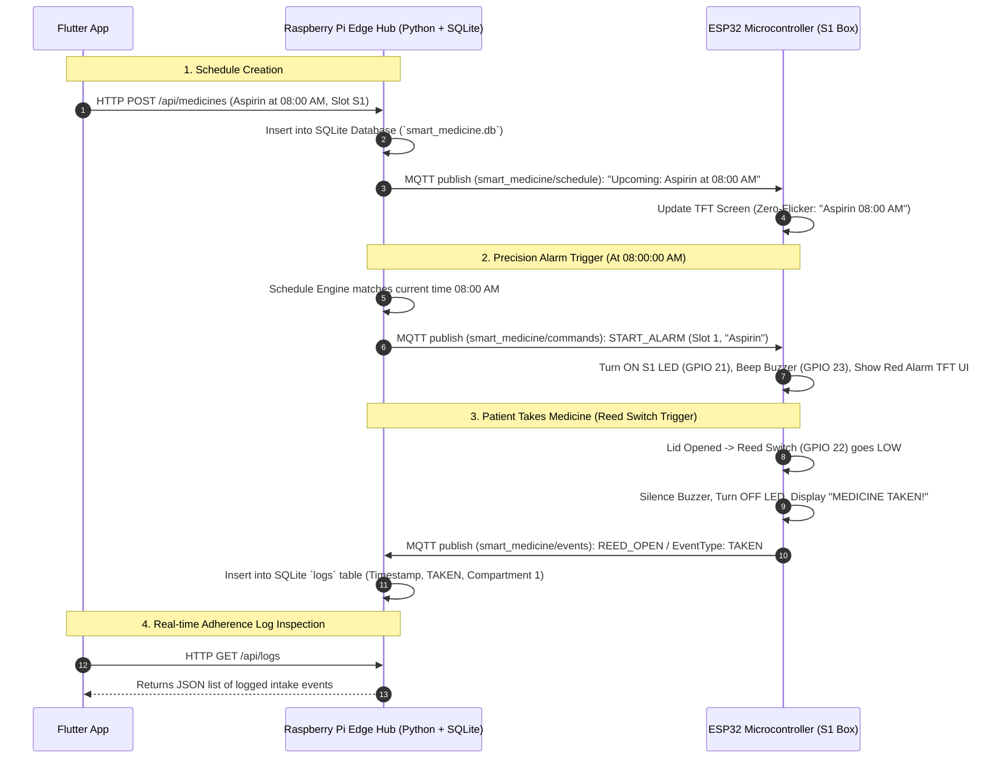

# Smart Medicine Organizer - System Architecture & Design Specification

This document provides a comprehensive explanation of the local edge hub architecture, component separation, communication protocols, and data flow for the Smart Medicine Organizer project.

---

## 1. System Architecture Overview

```
 ┌──────────────────────────┐                 ┌──────────────────────────┐
 │    Flutter Mobile App    │                 │   ESP32 Microcontroller  │
 │   (Dumb UI / Controller) │                 │ (Dumb Hardware Actuator) │
 └─────────────┬────────────┘                 └─────────────▲────────────┘
               │                                            │
        HTTP REST API                                MQTT Topics
    (http://<PI_IP>:5000/api)                   (port 1883 over Wi-Fi)
               │                                            │
               └────────────────────┬───────────────────────┘
                                    │
                                    ▼
 ┌───────────────────────────────────────────────────────────────────────┐
 │                      RASPBERRY PI (The Central Hub)                   │
 │                                                                       │
 │  1. Mosquitto MQTT Broker (port 1883)                                │
 │  2. SQLite Local Database (`smart_medicine.db`)                      │
 │  3. Python Central Backend Server (`pi_server.py`)                    │
 │     • Flask REST API Server (port 5000)                              │
 │     • Precision 1-Sec Schedule Engine & Alarm Trigger                │
 │     • Live Time & Next Dose MQTT Broadcast                           │
 └───────────────────────────────────────────────────────────────────────┘
```

---

## 2. Design Philosophy: Edge Computing & Zero Cloud Dependency

The system is designed around **Local Edge Computing**:

* **Zero Cloud Dependency & $0 Operating Cost**: Eliminates paywalled cloud backends (Firebase, AWS, GCP). The system runs 100% self-hosted on local Wi-Fi without requiring an active internet connection.
* **100% Medical Data Privacy**: Patient schedules, dosage history, and adherence logs remain entirely within the home local network.
* **Clear Division of Responsibilities**:
  * **Raspberry Pi = The Central Brain & Database**: Manages state, timekeeping, scheduling, database persistence, and API routing.
  * **ESP32 = The Dumb Hardware Hand**: Listens purely for MQTT commands to actuate LEDs/Buzzers and reads physical sensors (Reed Switch).
  * **Flutter App = The Dumb Display & Input Screen**: Serves strictly as a user interface for creating schedules and viewing logs via HTTP REST endpoints.

---

## 3. End-to-End Sequence Diagram



---

## 4. Component Breakdown & Implementation Details

### A. Raspberry Pi Central Edge Hub (`pi_server.py`)
The Raspberry Pi runs three synchronized background threads:

1. **Mosquitto MQTT Broker (Port 1883)**:
   - Handles low-latency local pub/sub messaging between Pi and ESP32 over Wi-Fi.

2. **SQLite Relational Database (`smart_medicine.db`)**:
   - `medicines`: Stores medicine ID, name, compartment slot (1-6), dosage, instructions, times (`["08:00", "20:00"]`), days, and active status.
   - `logs`: Stores autoincrement ID, compartment number, timestamp, event type (`TAKEN`, `MISSED`, `WRONG_COMPARTMENT`), and details.
   - `device_state`: Stores online heartbeat state, battery level, and last seen timestamps for ESP32 devices.

3. **Precision Schedule Checker Loop (1-Second Interval)**:
   - Evaluates system time `HH:MM` every second against active database schedules.
   - Publishes `START_ALARM` MQTT command at exact `:00` seconds when a dose is due.
   - Computes the next upcoming dose across active medicines and broadcasts to `smart_medicine/schedule`.

4. **Flask HTTP REST API (Port 5000)**:
   - `GET /api/health` -> Connection diagnostic check.
   - `GET /api/medicines` -> Fetches active medicine list.
   - `POST /api/medicines` -> Creates a new medicine schedule.
   - `PUT /api/medicines/<id>` -> Updates an existing schedule.
   - `DELETE /api/medicines/<id>` -> Discontinues a schedule.
   - `GET /api/logs` -> Returns adherence activity history.
   - `GET /api/device/state` -> Returns ESP32 connection state & compartment statuses.
   - `POST /api/device/test-alarm` -> Sends instant test alarm command to ESP32 for testing.

---

### B. ESP32 Microcontroller Hardware (`espcode_sample.ino`)
The ESP32 acts as a lightweight MQTT hardware peripheral mapped directly to GPIO pins (no I2C expanders required):

* **Hardware Wiring Pinout**:
  * **RTC DS3231**: `GPIO 19` (SDA), `GPIO 18` (SCL)
  * **ST7735 1.8" TFT Screen**: `GPIO 15` (SCK), `GPIO 2` (MOSI), `GPIO 4` (A0/DC), `GPIO 16` (RESET), `GPIO 17` (CS)
  * **Alarm Actuators**: `GPIO 21` (S1 LED Indicator), `GPIO 23` (Buzzer)
  * **Adherence Sensor**: `GPIO 22` (Reed Switch door sensor with `INPUT_PULLUP`)

* **Zero-Flicker TFT Display Engine**:
  * Eliminates full-screen clearing (`tft.fillScreen`) on time ticks.
  * Draws the static UI frame once (`drawStandbyFrame`).
  * Performs selective character overwriting using text background fill (`tft.setTextColor(color, ST7735_BLACK)`), updating values ONLY when characters change.

* **Adherence & Alarm Routine**:
  * Listens to `smart_medicine/commands`. On `START_ALARM`, activates LED, beeps buzzer, and renders alarm UI.
  * Monitors Reed Switch (`GPIO 22`). When the magnet moves (lid open), it silences buzzer, turns off LED, displays "MEDICINE TAKEN!", and publishes `REED_OPEN` event to `smart_medicine/events`.

---

### C. Flutter Mobile Companion App (`lib/`)
The cross-platform Flutter application connects directly to the Raspberry Pi's IP address over local Wi-Fi:

* **Service Layer (`PiApiService`)**: Replaces Firebase Firestore SDK with standard HTTP REST calls via `package:http`.
* **State Management**: Uses `Provider` pattern (`AuthProvider`, `MedicineProvider`, `LogProvider`, `DeviceProvider`) to poll API state periodically.
* **Organizer Grid UI**: Renders a 6-compartment grid layout (S1 - S6), visually highlighting **Compartment S1** as the active physical hardware box.

---

## 5. MQTT Topic Topology & Payload Specifications

### 1. `smart_medicine/commands` (Pi -> ESP32)
Used by the Raspberry Pi to command hardware actions.
```json
{
  "action": "START_ALARM",
  "compartment": 1,
  "medicine": "Aspirin",
  "dosage": "1 Pill"
}
```

### 2. `smart_medicine/schedule` (Pi -> ESP32)
Used for live time synchronization and next dose display.
```json
{
  "nextMedicine": "Aspirin",
  "nextTime": "08:00",
  "dosage": "1 Pill",
  "compartment": 1,
  "systemTime": "10:45:26"
}
```

### 3. `smart_medicine/events` (ESP32 -> Pi)
Published by ESP32 when a hardware sensor triggers.
```json
{
  "deviceId": "ESP32_001",
  "compartment": 1,
  "event": "REED_OPEN",
  "eventType": "TAKEN",
  "details": "Medicine taken from Compartment S1"
}
```

### 4. `smart_medicine/heartbeat` (ESP32 -> Pi)
Published every 5 seconds by ESP32 to maintain online status.
```json
{
  "deviceId": "ESP32_001",
  "isOnline": true,
  "batteryLevel": 98,
  "activeSlot": 1
}
```
